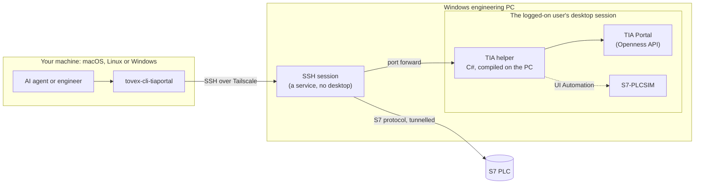

# tovex-cli

Command-line control of Siemens TIA Portal and live S7 PLCs, engineering
software that was only ever built for a mouse. Every action is a one-shot
command with JSON output, so an AI agent such as Claude Code can create,
compile, download and test a PLC program the way an engineer would, and every
step can be scripted, logged and repeated.

> Source lives in a private repository. This repo is a public overview.

## What it covers

`tovex-cli-tiaportal` drives Siemens TIA Portal V21 and V17, S7-PLCSIM, and
S7-1200 and S7-1500 PLCs: projects, hardware, the PLC program, compile,
download, online compare, WinCC Comfort/Advanced objects, libraries, any
object attribute, the simulator, and live PLC values by address or tag name.

## A short session

Commands typed on a Mac. TIA Portal runs on a Windows PC elsewhere, with the
PLC on that PC's Ethernet port.

```text
$ tovex-cli-tiaportal portal attach            # use the TIA Portal already open on the PC
$ tovex-cli-tiaportal plc source-import conveyor.scl
$ tovex-cli-tiaportal compile                  # exit 1 on compile errors
$ tovex-cli-tiaportal download                 # PLCSIM by default; a real PLC needs --yes

$ tovex-cli-tiaportal --json live read '"TestData".Sum' TestData.Scaled TestData.Enable MW100
{
  "cpu": "RUN",
  "values": [
    {"address": "\"TestData\".Sum", "value": 1166},
    {"address": "TestData.Scaled", "value": 12.34},
    {"address": "TestData.Enable", "value": false},
    {"address": "MW100", "value": 0}
  ],
  "target": "ssh://user@plant-pc"
}

$ tovex-cli-tiaportal --json live write TestData.A 500
{"error": "writing TestData.A changes a running PLC; pass --yes to confirm", "type": "refused", "target": "ssh://user@plant-pc"}
$ echo $?
2
```

## Built for agents

- **One command, one process.** The CLI opens and reuses its connections on
  its own; the state lives on the PC, next to the software.
- **`--json` on every command**, and every result names the machine it ran on.
- **Exit codes that mean something:** 0 done; 1 the software reported a failure
  (compile errors, a failed download), with the full result still in the JSON;
  2 invalid input or a refused action; 124 timeout; 255 the PC could not be
  reached.
- **A skill file**, so an agent learns the commands, the safety rules and the
  pitfalls without reading the source.
- **A REPL** for people who would rather type.

## How it works



**Windows keeps the desktop away from SSH.** Windows starts SSH sessions in a
service session that has no desktop, but a TIA Portal with a window,
S7-PLCSIM and UI Automation all live in the logged-on user's desktop. So the
CLI keeps a small helper there, started on demand, as that user and without
admin rights.

**Built on the PC, from source.** The helper is C#, compiled on the PC by the
.NET compiler that ships with Windows, so nothing has to be installed. It
carries a digest of the source it was built from, so `host start` can tell in
one round trip whether it is current, and rebuilds and restarts it only when
the source changed.

**TIA Portal stays open.** The helper holds the Openness connection and the
open project between commands. A command costs one request, about 15 ms on
the PC, instead of a TIA Portal start of about 12 s.

**No request is ever sent twice.** Requests travel over a kept-open SSH port
forward, and the helper greets every connection before it reads a request.
The CLI can therefore tell "never arrived" (safe to retry) from "arrived, then
the link dropped" (reported, never retried), so a download or a PLC write
cannot run twice by accident.

**Live values bypass TIA Portal.** The CLI speaks the S7 protocol itself, in
pure Python, through the same SSH link to the PLC on the PC's Ethernet port.
The PLC needs no route to your machine, and all reads in one command are
packed into as few protocol requests as fit. Tag names are looked up in the
open TIA project and cached; the values themselves never pass through TIA
Portal.

**Remote by default.** The PC is reached over a private Tailscale network, so
the CLI behaves the same at the desk or away from it. One defaults file points
the CLI at the PC and the PLC.

## Commands

| Group | Commands |
|---|---|
| `project` | create, open (with upgrade), save, save as, archive, retrieve, close |
| `device`, `aml` | add devices by order number, list, delete; hardware as AutomationML |
| `plc` | blocks, tag tables, PLC data types and watch tables: list, show, export and import as XML, delete; SCL source in and out |
| `compile` | software, or hardware and software; errors and warnings as JSON |
| `download` | to PLCSIM by default, or to a PLC through any PG/PC interface |
| `online` | status, go online, go offline, interfaces, subnets, compare offline with online |
| `hmi` | WinCC Comfort/Advanced screens, tag tables, text and graphic lists, connections, VB scripts, templates |
| `library` | global and project libraries |
| `obj` | any object in the project: read and write attributes, invoke actions; for everything without a dedicated command |
| `sim` | start S7-PLCSIM and load it, RUN/STOP, status, close |
| `live` | read and write PLC values by address or tag name |
| `portal`, `host` | start TIA Portal headless or with its window, attach to one already open; the helper's lifecycle |
| `screenshot`, `ui` | the PC's screen, and UI Automation for windows nothing else reaches |

## Live values

```text
tovex-cli-tiaportal live read I0.0 QB0 MW100 MD20:real DB1.DBW10
tovex-cli-tiaportal live read '"TestData".Sum' TestData.Scaled MyTag
tovex-cli-tiaportal live write TestData.A 500 --yes
```

Addresses cover inputs, outputs, memory and data blocks. Names are PLC tags
from the tag tables and data-block members, looked up in the project open in
TIA Portal; their layouts are cached until the block changes. Types: Bool,
Byte, SInt, USInt, Char, Int, UInt, Word, DInt, UDInt, DWord, Real and Time.
Values can be written as `42`, `-5`, `16#2A`, `2#101`, `1.5` or `true`.

## Speed

Measured end to end from the workstation, median of three runs, with the
helper attached to an open project:

| Command | Time |
|---|---|
| `host status`, `portal status`, `project info` | 0.14–0.18 s |
| `plc blocks`, `plc tags`, `device list`, `online status` | 0.16–0.18 s |
| `live read` by address, any number of values | 0.14 s |
| `live read` by name | 0.27 s for one name, 0.39 s for five |

Most of that is Python starting; the exchange with the PLC takes about 10 ms.
The first command after a pause adds about half a second while the SSH
connection opens. Before the work in the engineering notes below, a read by
name took 5.5 s and a helper command 2.6 s.

## Accuracy

- **A bit write touches one bit.** Writing `M100.3` uses the protocol's bit
  write, not a read-modify-write of the whole byte that could undo a bit the
  PLC changed in between.
- **Every write is read back.** If the program overwrites the value on its next
  scan, the command fails and says so: `wrote 999 but read back 466`.
- **Values are checked before anything is sent.** 300 for a byte, 1.5 for an
  Int, 2 for a Bool: refused with exit 2.
- **Names never guess.** A name that matches both a tag and a data-block member
  is refused as ambiguous, and quoting follows TIA Portal's own rules.
- **No silent wrong bytes.** Member offsets come from the project. If a data
  block was changed but not downloaded, those offsets point at other data, so
  before reading by name the CLI checks that the PLC's copy of the block has
  the project's length, and refuses with `layout-mismatch` if it doesn't.
- **Reals read as written:** 12.34, not 12.3400002.
- **The CPU mode is read, not assumed.** The S7-1200 G2 refuses the usual
  state query, so the CLI reads RUN or STOP from the CPU's status list.

## Safety

- Downloads go to PLCSIM unless an interface is named. A real PLC also needs
  `--yes`, because a download may stop it.
- A PLC certificate that can't be verified is trusted only for the simulator,
  or when you say so with `--trust-certificate`.
- Closing never drops unsaved work without `--save` or `--discard`, and nothing
  is written to the project file until `project save`.
- When TIA Portal asks a question during a command, the helper answers with the
  safest choice (Cancel or No) and reports it. Questions raised by someone
  working in TIA Portal's window stay with that person.
- Downloads to safety PLCs (F-CPUs) are deliberately left to TIA Portal.

## Engineering notes

**Name reads went from 5.5 s to 0.27 s.** Some of that was plumbing: each
call used to start PowerShell on the PC, and now it is one request over a
connection that stays open. The rest was TIA Portal itself. Every property
read through its API is a round trip into TIA's process; just counting a
project's devices took about 300 ms. TIA also hands back a new proxy object
for the project on every call, so a cache keyed on that object never hit. The
helper now looks up only the names asked for and keys its cache on the
project's path, and TIA's share of a lookup fell to about 50 ms.

**A refused connection looked like a crash.** Windows takes about two seconds
to refuse a connection to a port nobody listens on, and the CLI first read
that as the helper dying mid-request. That ambiguity is why the helper now
greets every connection: a request goes out only after the greeting, so "not
there" and "dropped mid-request" can't be confused.

## Tested on real equipment

| Suite | Result |
|---|---|
| TIA Portal V21: unit tests, then end to end on the PC | 49 and 22 passed; the 6 simulator tests need S7-PLCSIM V21, which isn't installed yet |
| TIA Portal V17, the full suite including S7-PLCSIM | 67 of 67 passed |
| Live values on a real S7-1200 G2 (CPU 1214C, firmware 4.1) | the CLI's own S7 client returns the same bytes as python-snap7 for inputs, outputs, memory and data blocks; writes read back and restored |

Not covered by the automated suites: downloads to a real PLC (done by hand
through the CLI on the G2), HMI export and import, libraries, and retrieving
archives.

## Limits

- Live values cover I, Q, M and data blocks without optimized block access,
  elementary types only, and need PUT/GET access enabled in the CPU.
- S7-PLCSIM has to match the TIA Portal version.
- TIA Portal has to be installed and licensed on a Windows PC, with a user
  logged on to its desktop.

## Tech

Python 3.10+ · Click · pytest · C# 5 on .NET Framework 4.8, compiled on the
PC · PowerShell 5.1 · TIA Portal Openness V17 and V21 · UI Automation · the S7
protocol over ISO-on-TCP (own client, standard library only) · OpenSSH ·
Tailscale · uv

## Trademarks

Product names are trademarks of their respective owners. This project is
independent and is not affiliated with or endorsed by Siemens AG.
